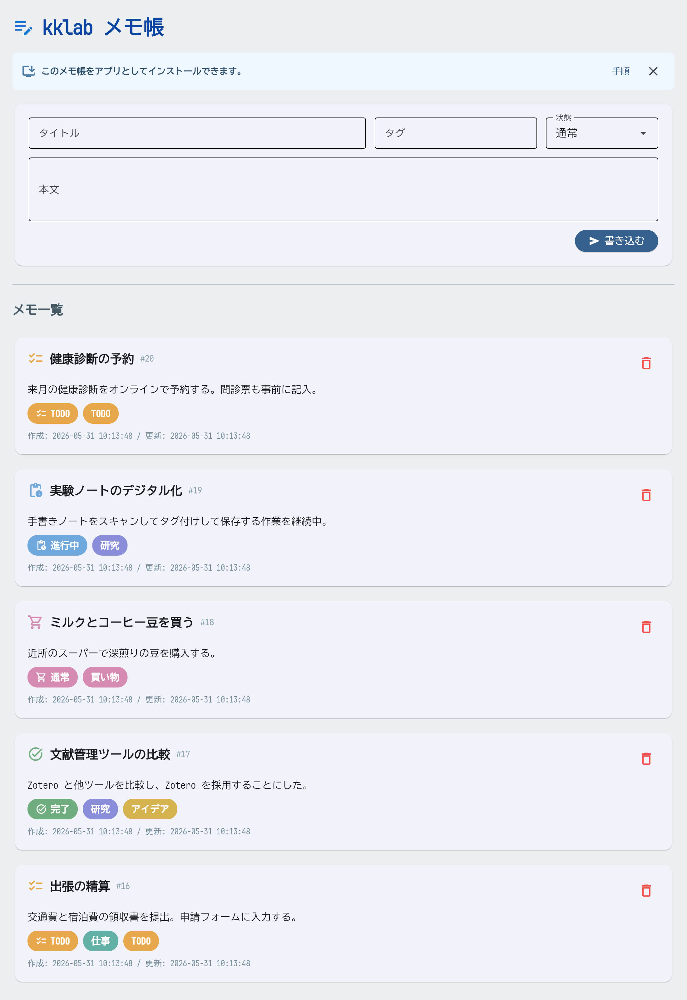

# kklab-flet-notes

Python の [Flet](https://flet.dev/) と SQLite3 で作成した、シンプルなローカルメモ帳アプリです。
GitHub などからローカル環境へクローンし、単体のデスクトップアプリ、または手元のブラウザで開くローカル Web アプリとして動かすことを前提にしています。公開ホスティングや複数人利用の運用は想定していません。

## スクリーンショット



ローカル Web アプリ（PWA）として表示した画面です。状態・タグに応じてメモのアイコンと色が変わります。

## 機能

- **書き込み** — タイトル・本文・タグ・状態を入力して保存します。タイトルまたは本文が空の場合は保存しません。
- **消去** — 各メモの削除ボタンから確認ダイアログを開き、不要なメモを削除します。
- **一覧表示** — メモは ID・タイトル・本文・タグ・状態・作成日時・更新日時つきで、新しい順に表示されます。
- **見分けやすさ** — メモのアイコンと色は状態を優先して変わります。状態が「通常」の場合は、`研究`、`仕事`、`アイデア`、`買い物`、`TODO` などのタグから自動で選びます。
- **インストール案内** — ローカル Web アプリとして開いた場合、PWA としてインストールするための案内を画面上部に表示します。
- **保存** — メモは SQLite3 の `notes.db` に保存されます。`notes.db` は初回起動時に自動生成され、リポジトリには含めません。

> 補足: このアプリは個人のローカル利用向けです。認証、ユーザー管理、外部公開用の設定はありません。

## ファイル構成

| ファイル | 役割 |
| --- | --- |
| `main.py` | Flet による UI（入力フォーム・メモ一覧・削除ダイアログ） |
| `db.py` | SQLite3 データ層（テーブル作成、旧スキーマ移行、メモの追加・取得・削除） |
| `assets/index.html` | ローカル Web アプリ用の HTML テンプレート |
| `assets/manifest.json` | ローカル Web アプリを PWA として認識させるためのマニフェスト |
| `assets/icons/` | PWA インストール時に使う PNG アイコン |
| `scripts/generate_pwa_icons.py` | PWA アイコンを再生成するスクリプト |
| `pyproject.toml` / `uv.lock` | [uv](https://docs.astral.sh/uv/) による依存管理 |
| `AGENTS.md` | コントリビューター向けの作業ガイド |
| `notes.db` | メモのデータ（初回起動時に自動生成。Git 管理対象外） |

## 必要環境

- Python 3.11 以上
- [uv](https://docs.astral.sh/uv/)（パッケージ・仮想環境管理）

## セットアップ

```bash
git clone <このリポジトリ>
cd kklab-flet-notes
uv sync          # 依存パッケージ（flet）を仮想環境にインストール
```

## 起動方法

起動方法は 3 通りあります。用途に合わせて選んでください。いずれも事前に[セットアップ](#セットアップ)（`uv sync`）を済ませておきます。

| 方法 | コマンド / 操作 | 向いている用途 |
| --- | --- | --- |
| A. デスクトップアプリ | `uv run python main.py` | ネイティブウィンドウで手軽に使う |
| B. 開発用 Web サーバー | `uv run flet run --web main.py` | UI を編集しながらブラウザで確認（ホットリロード） |
| C. PWA（推奨・常用向け） | OS 別ランチャー → ブラウザでインストール | アプリのように常用する |

> どの方法で起動しても、データは同じ `notes.db`（リポジトリ直下に自動生成）に保存されます。起動方法を切り替えてもメモは引き継がれます。

### 方法 A: 単体デスクトップアプリとして起動

```bash
uv run python main.py
```

ネイティブウィンドウでアプリが開きます。いちばん手軽な方法です。

> 一部の Linux 環境（ChromeOS の Linux 開発環境など、OpenGL/GLX が使えない環境）では、デスクトップウィンドウの描画に失敗して起動できないことがあります。その場合は方法 B または C（ブラウザ表示）を使ってください。

### 方法 B: ローカル Web アプリとして起動（開発用）

```bash
uv run flet run --web main.py
```

手元の開発サーバーを起動し、ブラウザで自動的にアプリを開きます。ファイルを保存すると自動で再読み込みされる（ホットリロード）ため、UI を編集しながら確認するのに向いています。外部公開用のデプロイ設定は含めていません。

### 方法 C: PWA として常用する（推奨）

PWA（Progressive Web App）としてインストールすると、ブラウザのタブではなく独立したウィンドウでアプリのように使えます。OS ごとにバックエンドサーバーを起動するランチャーを用意しています。

> **仕組みの前提**: Flet の Web アプリは Python バックエンドに常時接続して動きます（静的な PWA ではありません）。そのため **PWA を使っている間は、下記のランチャーでサーバーを起動しておく必要があります**。サーバーを止めるとアプリは表示できなくなります。

#### 手順 1. サーバーを起動する

OS に合わせてランチャーを実行します。いずれも `http://localhost:8550`（固定ポート・`127.0.0.1` のみ）で待ち受け、**ブラウザは自動では開きません**。

| OS | ランチャー | 起動方法 |
| --- | --- | --- |
| Linux | `start-notes.sh` | ターミナルで `./start-notes.sh` |
| macOS | `start-notes.command` | Finder でダブルクリック（ターミナルなら `./start-notes.sh` でも可） |
| Windows | `start-notes.bat` | エクスプローラーでダブルクリック |

起動すると、ターミナル（または開いたウィンドウ）に `http://localhost:8550` と表示されます。

#### 手順 2. ブラウザで開く

Chrome または Edge で `http://localhost:8550` を開きます。画面上部に「このメモ帳をアプリとしてインストールできます。」という案内が表示されます。

#### 手順 3. PWA としてインストールする

- **Chrome / Edge**: アドレスバー右側に出るインストールアイコン（⊕ のようなマーク）を押します。
- アイコンが出ない場合は、ブラウザのメニューから **「アプリをインストール」**（または「インストール」）を選びます。

インストールすると、デスクトップ／スタートメニュー／Launchpad などにアイコンが追加されます。

#### 手順 4. 2 回目以降

1. ランチャー（`start-notes.sh` / `.command` / `.bat`）を起動してサーバーを立ち上げる。
2. 追加された PWA アイコンをクリックして開く。

#### サーバーの停止

- ターミナルで起動した場合: `Ctrl+C`
- Windows でダブルクリック起動した場合: ウィンドウを閉じる（または `Ctrl+C`）

#### ポートを変更したい場合

`start_url` を安定させるためポートは既定で `8550` に固定しています。変更したいときは環境変数 `KKLAB_PORT` を指定します。

```bash
# macOS / Linux
KKLAB_PORT=9000 ./start-notes.sh
```

```bat
rem Windows（コマンドプロンプト）
set KKLAB_PORT=9000
start-notes.bat
```

> ポートを変えると `start_url` も変わるため、PWA を入れ直す必要があります。

## 困ったとき

- **`uv: command not found`（または「uv は認識されていません」）**: uv が未インストールです。[uv](https://docs.astral.sh/uv/) を入れ、`uv sync` を実行してください。
- **デスクトップ版が起動しない / ウィンドウが真っ黒**: OpenGL を使えない環境の可能性があります。方法 B または C（ブラウザ表示）を使ってください。
- **`Address already in use`（ポート使用中）**: 既に同じポートでサーバーが動いています。先に起動済みのランチャーを止めるか、`KKLAB_PORT` で別のポートを指定してください。
- **PWA を開いても画面が出ない**: ランチャーでサーバーが起動しているか確認してください。PWA はサーバーが動いている間だけ表示できます。
- **Windows でバッチの日本語が文字化けする**: `start-notes.bat` は UTF-8 を前提にしています。古い Windows では `chcp 65001` が効かないことがありますが、動作自体には影響しません。

## 使い方

1. 上部のフォームに「タイトル」「タグ」「状態」「本文」を入力し、**書き込む** を押します。
2. 保存されたメモは「メモ一覧」に新しい順で表示されます。
3. 状態は `通常`、`TODO`、`進行中`、`完了`、`保留`、`重要` から選べます。
4. メモを消すには、対象カードの削除ボタンを押し、確認ダイアログで **削除** を押します。

## 開発メモ

- コードを変更したら、`uv run python main.py` で起動し、書き込み・入力エラー・削除・再起動後の読み込みを確認してください。
- Web 表示を変更した場合は、`uv run flet run --web main.py` でもローカルブラウザ表示を確認してください。
- コミット前に `git diff --check` で不要な空白がないか確認してください。
- 詳しい作業ルールは `AGENTS.md` を参照してください。

## ライセンス

[MIT License](LICENSE) の下で公開しています。© 2026 Katz Kawai

## 更新履歴

### v0.3.0 — 未リリース
- 個人利用向けに名前・パスワード欄を廃止。
- メモ項目をタイトル・本文・タグ・作成日時・更新日時の最小構成へ変更。
- 状態欄を追加し、状態またはタグに応じてメモのアイコンと色が変わるように変更。
- ローカル Web 起動時に PWA インストール案内を表示。
- PWA 用の 192px / 512px / maskable アイコンを追加。
- ローカルクローン後に、デスクトップアプリまたはローカル Web アプリとして動かす前提を明記。
- 文字サイズとカードの余白を全体的に拡大し、視認性を向上。
- PWA バックエンドを固定ポートで常駐させる手動ランチャーを追加（Linux: `start-notes.sh` / macOS: `start-notes.command` / Windows: `start-notes.bat`）。
- 改行コードを固定する `.gitattributes` を追加（`.bat` は CRLF、シェル系は LF）。
- MIT ライセンス（`LICENSE`）を追加し、`pyproject.toml` に明記。

### v0.2.0 — 2026-05-31
- アプリ名称を「掲示板」から「メモ帳」に変更。
- GitHub Pages 公開デモと、デプロイ用スクリプト（`deploy.sh` / `patch_web.py` / `coi-serviceworker`）を削除。
- データベースのファイル名を `board.db` → `notes.db`、テーブル名を `posts` → `notes` に変更。

### v0.1.0 — 2026-05-30
- 初版リリース。
- flet + SQLite3 による基本機能を実装（一覧表示・書き込み・消去）。
- 書き込みと消去にパスワード認証（`kklab`）を追加。
